[toc]

## Introduction

We report on the design and implementation of the relational database system of our question answering service. To use this  service, user required to sign up with their username, email and pasword. They can also have their profile, city, state, country, level information included. 

After signing up, user can post their question. Each question should specify one topic it belongs apart from title and body. There are some predefined topics stored in multi-level hierarchy. Each topic may have one parent topic. For example, Database is a sub-topic of Computer Science. 

Besides, user can also post answers to other questions. They may answer the same question for multiple times. They may also answer their own question for following up. We also record the likes of each answer, user can only like the answer for once. The questioner can mark the question whether it is solved or selecting the best answer according to the number of likes.

In order to encourage the user to get involved and make the forum more active. There are three kinds of level (basic, advanced, expert) telling the status of each user. The new user is in the basic level. The criteriums for the different levels is based on the number of answers user posted.

For simplicity of searching, users are able to search the posted questions and answers in the system using keyword queries. We utilize [fulltext search](https://dev.mysql.com/doc/refman/8.0/en/fulltext-boolean.html).  Its relevance ranking algorithm is based on the BM25 and TF-IDF. We assign more weights to questions compared with answers.


## (a)

The ER diagram can be represented as follows


Design:

1. Each answer posted by one user
2. Each question posted by one user
3. User can only like each answer for one time
4. Each answer answers one question 
5. Each question belongs to one topic
6. Each topic can only have one parent topic


The relation schema of database showed as follows:

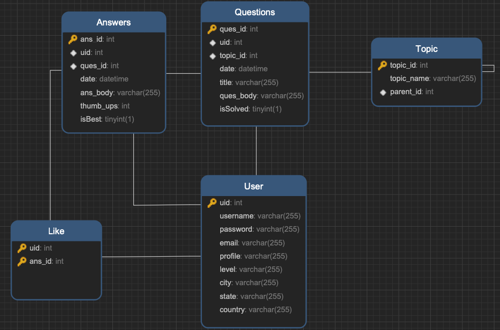

Constraints:

1. Each user, answer, and question, topic has their own id as the primary key.
2. Each answer must reference one user and one question.
3. Each question must reference one user and one topic.
4. Each topic reference one other topic as parent.
5. Each like must reference one user and one answer, the primary key is (uid, and_id).

Assumptions:

1. There are multi-level(equal to or more than 2) hierachies of topics.
2. The level of each user will not be updated immediately after he/she posts a new answer.
2. User can post multiple answers to the same question.
2. Each question can be provided with only one topic when posted.
2. Each topic may have only one direct parent topic.
2. User may post answer to their own question. 
2. User should only like the answer for one time.


## (b)

Environment:

```mysql
mysql> show variables like '%storage_engine%';
+---------------------------------+-----------+
| Variable_name                   | Value     |
+---------------------------------+-----------+
| default_storage_engine          | InnoDB    |
| default_tmp_storage_engine      | InnoDB    |
| disabled_storage_engines        |           |
| internal_tmp_mem_storage_engine | TempTable |
+---------------------------------+-----------+

mysql> select version();
+-----------+
| version() |
+-----------+
| 8.0.23    |
+-----------+
```

The SQL for create the database schema can be found at:

https://github.com/1092772959/CSGY_6083_Database/blob/main/Create.sql

```sql
DROP TABLE IF EXISTS `Like`;
DROP TABLE IF EXISTS `Answers`;
DROP TABLE IF EXISTS `Questions`;
DROP TABLE IF EXISTS `User`;
DROP TABLE IF EXISTS `Topic`;

-- Table structure for User
-- ----------------------------
CREATE TABLE `User` (
  `uid` int NOT NULL AUTO_INCREMENT PRIMARY KEY,
  `username` varchar(255) NOT NULL,
  `password` varchar(255) NOT NULL,
  `email` varchar(255) NOT NULL,
  `profile` varchar(255) DEFAULT NULL,
  `level` varchar(255) DEFAULT 'basic',
  `city` varchar(255) DEFAULT NULL,
  `state` varchar(255) DEFAULT NULL,
  `country` varchar(255) DEFAULT NULL,
  constraint level_check check(`level` in ('basic', 'advanced', 'expert'))
);

-- ----------------------------
-- Table structure for Topic
-- ----------------------------
CREATE TABLE `Topic` (
  `topic_id` int NOT NULL AUTO_INCREMENT PRIMARY KEY,
  `topic_name` varchar(255) NOT NULL,
  `parent_id` int DEFAULT NULL,
  CONSTRAINT `parent_id` FOREIGN KEY (`parent_id`) REFERENCES `Topic` (`topic_id`)
);

-- ----------------------------
-- Table structure for Questions
-- ----------------------------
CREATE TABLE `Questions` (
  `ques_id` int NOT NULL AUTO_INCREMENT PRIMARY KEY,
  `uid` int NOT NULL,
  `topic_id` int NOT NULL,
  `date` datetime DEFAULT NULL,
  `title` varchar(255) NOT NULL,
  `ques_body` text NOT NULL,
  `isSolved` tinyint(1) DEFAULT 0,
  fulltext search_idx_t(title),
  fulltext search_idx_b(ques_body),
  CONSTRAINT `topic_id` FOREIGN KEY (`topic_id`) REFERENCES `Topic` (`topic_id`),
  CONSTRAINT `uid_ques` FOREIGN KEY (`uid`) REFERENCES `User` (`uid`)
);

-- ----------------------------
-- Table structure for Answers
-- ----------------------------
CREATE TABLE `Answers` (
  `ans_id` int NOT NULL AUTO_INCREMENT PRIMARY KEY,
  `uid` int NOT NULL,
  `ques_id` int NOT NULL,
  `date` datetime DEFAULT NULL,
  `ans_body` text NOT NULL,
  `thumb_ups` int DEFAULT 0,
  `isBest` tinyint(1) DEFAULT 0,
  fulltext search_idx_a(ans_body),
  CONSTRAINT `ques_id` FOREIGN KEY (`ques_id`) REFERENCES `Questions` (`ques_id`),
  CONSTRAINT `uid_ans` FOREIGN KEY (`uid`) REFERENCES `User` (`uid`) 
);

-- ----------------------------
-- Table structure for Like
-- ----------------------------
CREATE TABLE `Like` (
  `uid` int NOT NULL,
  `ans_id` int NOT NULL,
  PRIMARY KEY (`uid`,`ans_id`),
  CONSTRAINT `ans_id` FOREIGN KEY (`ans_id`) REFERENCES `Answers` (`ans_id`),
  CONSTRAINT `uid` FOREIGN KEY (`uid`) REFERENCES `User` (`uid`)
);

SET FOREIGN_KEY_CHECKS = 1;
```


## (c)

#### (1)

```mysql
-- q1
insert into User (username, email, password, city, state, country, profile)
values ("Jaccob James", "corinna8@euneeedn.com", '123456', 'New York City', "NY",
    "United States", "This person is lazy.");
```

#### (2)

```mysql
-- 2) insert the question
insert into Questions(uid, topic_id, date, title, ques_body)
values (1, 5, NOW(), 'Shift 2D Grid', 
'Given a 2D grid of size m x n and an integer k. You need to shift the grid k times. Return the 2D grid after applying shift operation k times.');
```

#### (3)

Justification: 

```mysql
update `User` u
left join (
select uid, count(a.ans_id) as answer_cnt
from `Answers` a 
group by uid
) tmp on tmp.uid = u.uid
set u.level = CASE
            WHEN answer_cnt is NULL OR answer_cnt < 3 THEN 'basic'
            WHEN answer_cnt >= 3 AND answer_cnt < 5 THEN 'advanced'
            WHEN answer_cnt >= 5 THEN 'expert'
            END;
```

#### (4)

```mysql
-- suppose we want to get all the answers of question 3
select q.ques_id, a.ans_id, a.ans_body, a.date, a.isBest
from Questions q
         join Answers a on q.ques_id = a.ques_id
where q.ques_id = 3
order by a.date;
```

#### (5)

Jusitication:  For both upper and lower level hierarchy topics, we calculate the number of questions and answers. For upper level one, we use recursive query to get all the lower level topics under it. The temprary relation `topic_group` records each topic and all the topics under it. Also, we have to add itself into this relation. Then use join and group by to calculate the number of questions under each topic.

```mysql
with recursive topic_group(tid, sub_tid) as (
    select parent_id, topic_id
    from Topic
    where parent_id is not NULL
    union all
    select tg.tid, t.topic_id
    from Topic t
    join topic_group tg on t.parent_id = tg.sub_tid
    where parent_id is not NULL
)
select total.tid, COUNT(DISTINCT q.ques_id) as QuestionNumber
, COUNT(a.ans_id) as AnswerNumber
from (select * from topic_group tg union select topic_id, topic_id from topic) total
left join Questions q on total.sub_tid = q.topic_id
left join Answers a on q.ques_id = a.ques_id
group by total.tid;
```

#### (6)

Jusitication: We utilize [fulltext search](https://dev.mysql.com/doc/refman/8.0/en/fulltext-boolean.html) for this question. Its relevance ranking is based on the BM25 and TF-IDF. Besides, we add different weights to title, question body and answers to better reflect the relevance. We believe the questions' scores are more important than those of answers. The coefficients are 5.0, 3.0 and 1.0 respectively.

```mysql
select q.ques_id, q.title, sum(score) as score_sum
from (
    select ques_id, 5.0 * MATCH(title)
                AGAINST ('indexes MySQL' IN BOOLEAN MODE) as score
    from Questions
    where topic_id = 4
 union all
    select ques_id, 3.0 * MATCH(ques_body)
                AGAINST ('indexes MySQL' IN BOOLEAN MODE) as score
    from Questions
    where topic_id = 4
 union all
    select a.ques_id, 1.0 * SUM(MATCH(ans_body)
                AGAINST ('indexes MySQL' IN BOOLEAN MODE)) as score
    from Answers a 
    join Questions Q on a.ques_id = Q.ques_id
    where q.topic_id = 4
    group by a.ques_id
) tmp
join Questions q on q.ques_id = tmp.ques_id
group by tmp.ques_id
order by score_sum desc;
```


## (d)

#### Test Results

##### (1)

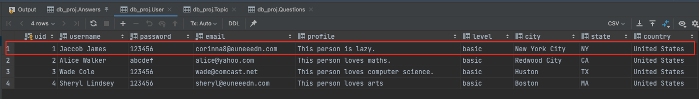

##### (2)


##### (3)


Clarification: As the result shows, Jaccob James is still basic user because he answered zero question, while Alice Walker and Wade Cole have been updated to adanced and expert respectively because they have answered 5 and 3 questions.

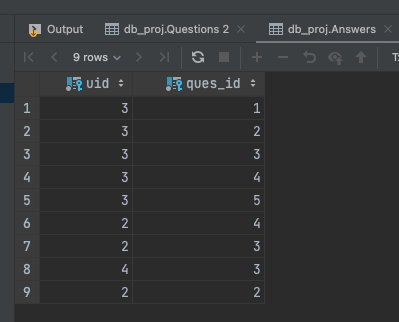

<figure>
  <figcaption align="center"><b>User-Answers Relation</b></figcaption>
</figure>

##### (4)

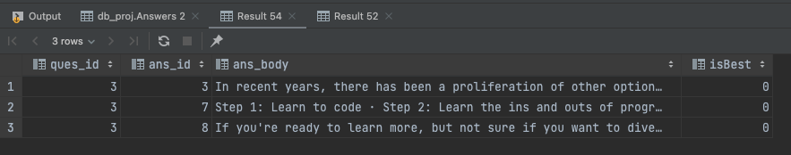

<figure>
  <figcaption align="center"><b>Result 4</b></figcaption>
</figure>

Clarification: Suppose given question id 3, we could get three answers. We can check the results by the orignal table Answers.

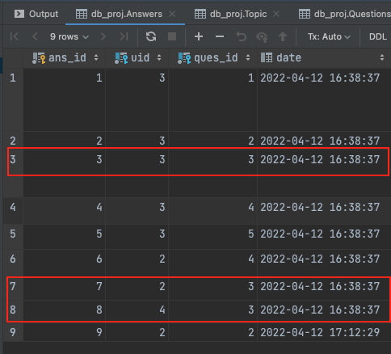

<figure>
  <figcaption align="center"><b>Answers Rows</b></figcaption>
</figure>

##### (5)

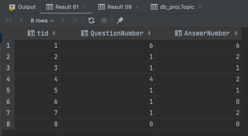

<figure>
  <figcaption align="center"><b>Result 5</b></figcaption>
</figure>

Clarification: We can illustrate the results by hand. For example, topic `Computer Science`(topic_id 1) has topic `Algorithms`(5) and `Database`(4) under it. Also, `Database` has `NoSQL`(6) under it. Therefore, CS should sum up all the questions and answers under those sub-topics. Let's look at questions number. It equals to 4 + 1 + 1 = 6. So the solution is correct. Plus, this solution will not miss topic with zero question or answer as it uses left join.

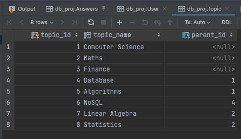

<figure>
  <figcaption align="center"><b>Topics</b></figcaption>
</figure>
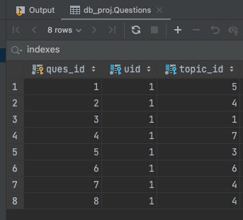

<figure>
  <figcaption align="center"><b>QuestionID-TopicID</b></figcaption>
</figure>
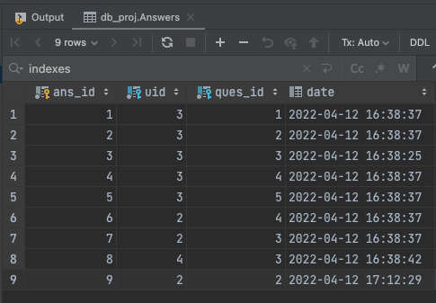

<figure>
  <figcaption align="center"><b>AnswerID-TopicID</b></figcaption>
</figure>

##### (6)

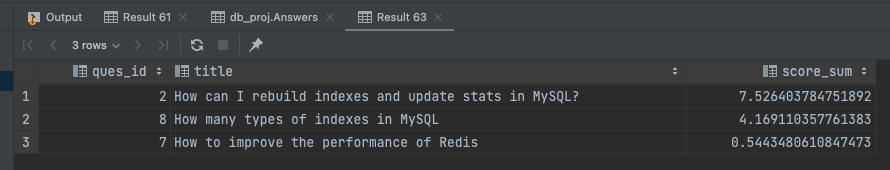

<figure>
  <figcaption align="center"><b>Result 6</b></figcaption>
</figure>

Clarification: Question 2 gets the highest score because it contains both of the keywords("indexes" and "MySQL") in both the title and the question body. Also, there is an answer of it containing keyword "indexes". Q8 ranks 2nd as it has both keywords in its title but only has one keyword in the question body and no answer containing any keyword. Q7 get the lowest score since only its question body contains one keyword. 

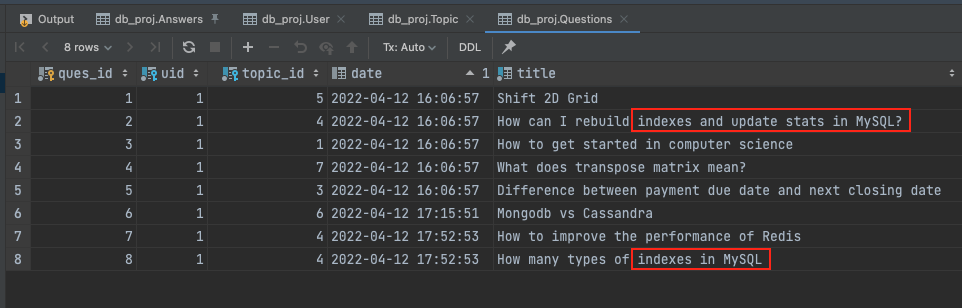

<figure>
  <figcaption align="center"><b>Question Title</b></figcaption>
</figure>

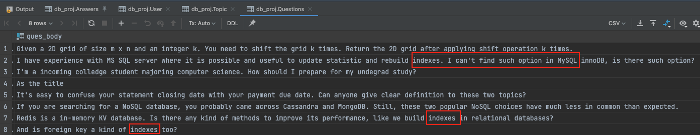

<figure>
  <figcaption align="center"><b>Question Body</b></figcaption>
</figure>

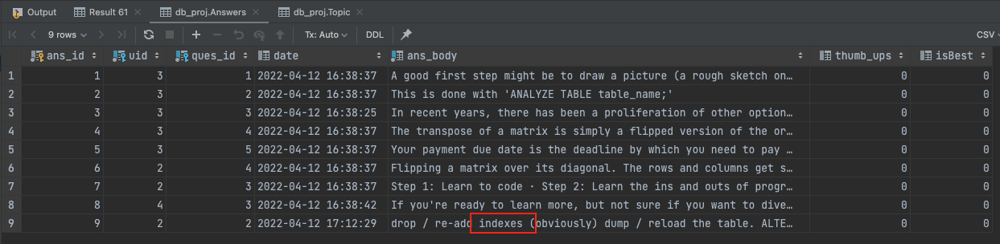

<figure>
  <figcaption align="center"><b>Answers Body</b></figcaption>
</figure>
