## Introduction

We report on the design and implementation of the relational database system of our question answering service. To use this  service, user required to sign up with their username, email and pasword. They can also have their profile, city, state, country, level information included. 

After signing up, user can post their question. Each question should specify one topic it belongs apart from title and body. There are some predefined topics stored in multi-level hierarchy. Each topic may have one parent topic. For example, Database is a sub-topic of Computer Science. 

Besides, user can also post answers to other questions. They may answer the same question for multiple times. We also record the likes of each answer, user can only like the answer for once. The questioner can mark the question whether it is solved or selecting the best answer according to the number of likes.

In order to encourage the user to get involved and make the forum more active. There are three kinds of level (basic, advanced, expert) telling the status of each user. The new user is in the basic level. The criteriums for the different levels is based on the number of answers user posted.

For simplicity of searching, users are able to search the posted questions and answers in the system using keyword queries. We utilize [fulltext search](https://dev.mysql.com/doc/refman/8.0/en/fulltext-boolean.html).  Its relevance ranking algorithm is based on the BM25 and TF-IDF. We assign more weights to questions compared with answers.


## (a)

The ER diagram can be represented as follows

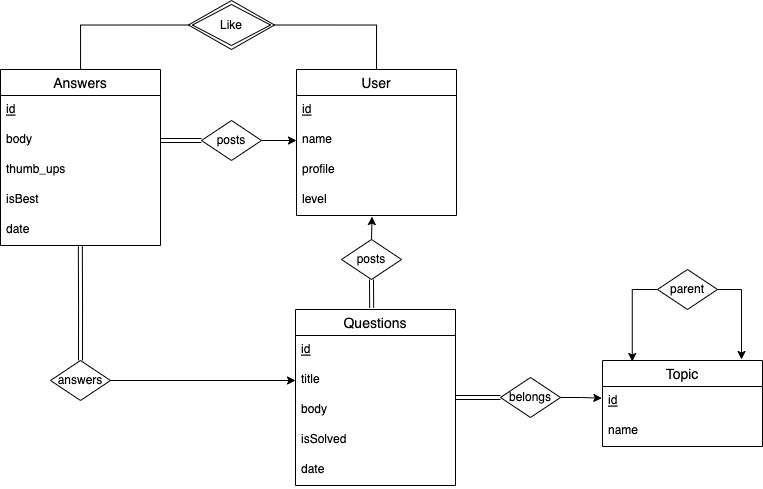

Design:

1. Each answer posted by one user
2. Each question posted by one user
3. User can only like each answer for one time
4. Each answer answers one question 
5. Each question belongs to one topic
6. Each topic may have one direct parent topic


The relation schema of database showed as follows:


Constraints:

1. Each user, answer, and question, topic has their own id as the primary key.
2. Each answer must reference one user and one question.
3. Each question must reference one user and one topic.
4. Each topic reference one other topic as parent.
5. Each like must reference one user and one answer, the primary key is (uid, and_id).

Assumptions:

1. There are multi-level(equal to or more than 2) hierachies of topics.
2. The level of each user will not be updated immediately after he/she posts a new answer.
3. User can post multiple answers to the same question.
4. Each question can be provided with one topic when posted.
5. Each topic may have one direct parent topic.


## (b)

Environment:

```sql
mysql> show variables like '%storage_engine%';
+---------------------------------+-----------+
| Variable_name                   | Value     |
+---------------------------------+-----------+
| default_storage_engine          | InnoDB    |
| default_tmp_storage_engine      | InnoDB    |
| disabled_storage_engines        |           |
| internal_tmp_mem_storage_engine | TempTable |
+---------------------------------+-----------+

mysql> select version();
+-----------+
| version() |
+-----------+
| 8.0.23    |
+-----------+
```

The SQL for create the database schema can be found at:

https://github.com/1092772959/CSGY_6083_Database/blob/main/Create.sql

```sql
DROP TABLE IF EXISTS `Like`;
DROP TABLE IF EXISTS `Answers`;
DROP TABLE IF EXISTS `Questions`;
DROP TABLE IF EXISTS `User`;
DROP TABLE IF EXISTS `Topic`;

-- Table structure for User
-- ----------------------------
CREATE TABLE `User` (
  `uid` int NOT NULL AUTO_INCREMENT PRIMARY KEY,
  `username` varchar(255) NOT NULL,
  `password` varchar(255) NOT NULL,
  `email` varchar(255) NOT NULL,
  `profile` varchar(255) DEFAULT NULL,
  `level` varchar(255) DEFAULT 'basic',
  `city` varchar(255) DEFAULT NULL,
  `state` varchar(255) DEFAULT NULL,
  `country` varchar(255) DEFAULT NULL,
  constraint level_check check(`level` in ('basic', 'advanced', 'expert'))
);

-- ----------------------------
-- Table structure for Topic
-- ----------------------------
CREATE TABLE `Topic` (
  `topic_id` int NOT NULL AUTO_INCREMENT PRIMARY KEY,
  `topic_name` varchar(255) NOT NULL,
  `parent_id` int DEFAULT NULL,
  CONSTRAINT `parent_id` FOREIGN KEY (`parent_id`) REFERENCES `Topic` (`topic_id`)
);

-- ----------------------------
-- Table structure for Questions
-- ----------------------------
CREATE TABLE `Questions` (
  `ques_id` int NOT NULL AUTO_INCREMENT PRIMARY KEY,
  `uid` int NOT NULL,
  `topic_id` int NOT NULL,
  `date` datetime DEFAULT NULL,
  `title` varchar(255) NOT NULL,
  `ques_body` text NOT NULL,
  `isSolved` tinyint(1) DEFAULT 0,
  fulltext search_idx_t(title),
  fulltext search_idx_b(ques_body),
  CONSTRAINT `topic_id` FOREIGN KEY (`topic_id`) REFERENCES `Topic` (`topic_id`),
  CONSTRAINT `uid_ques` FOREIGN KEY (`uid`) REFERENCES `User` (`uid`)
);

-- ----------------------------
-- Table structure for Answers
-- ----------------------------
CREATE TABLE `Answers` (
  `ans_id` int NOT NULL AUTO_INCREMENT PRIMARY KEY,
  `uid` int NOT NULL,
  `ques_id` int NOT NULL,
  `date` datetime DEFAULT NULL,
  `ans_body` text NOT NULL,
  `thumb_ups` int DEFAULT 0,
  `isBest` tinyint(1) DEFAULT 0,
  fulltext search_idx_a(ans_body),
  CONSTRAINT `ques_id` FOREIGN KEY (`ques_id`) REFERENCES `Questions` (`ques_id`),
  CONSTRAINT `uid_ans` FOREIGN KEY (`uid`) REFERENCES `User` (`uid`) 
);

-- ----------------------------
-- Table structure for Like
-- ----------------------------
CREATE TABLE `Like` (
  `uid` int NOT NULL,
  `ans_id` int NOT NULL,
  PRIMARY KEY (`uid`,`ans_id`),
  CONSTRAINT `ans_id` FOREIGN KEY (`ans_id`) REFERENCES `Answers` (`ans_id`),
  CONSTRAINT `uid` FOREIGN KEY (`uid`) REFERENCES `User` (`uid`)
);

SET FOREIGN_KEY_CHECKS = 1;
```


## (c)

#### (1)

```sql
-- q1
insert into User (username, email, password, city, state, country, profile)
values ("Jaccob James", "corinna8@euneeedn.com", '123456', 'New York City', "NY",
    "United States", "This person is lazy.");
```

#### (2)

```sql
-- 2) insert the question
insert into Questions(uid, topic_id, date, title, ques_body)
values (1, 5, NOW(), 'Shift 2D Grid', 
'Given a 2D grid of size m x n and an integer k. You need to shift the grid k times. Return the 2D grid after applying shift operation k times.');
```

#### (3)

Justification: 

```sql
update `User` u
left join (
select uid, count(a.ans_id) as answer_cnt
from `Answers` a 
group by uid
) tmp on tmp.uid = u.uid
set u.level = CASE
            WHEN answer_cnt is NULL OR answer_cnt < 3 THEN 'basic'
            WHEN answer_cnt >= 3 AND answer_cnt < 5 THEN 'advanced'
            WHEN answer_cnt >= 5 THEN 'expert'
            END;
```

#### (4)

```sql
-- suppose we want to get all the answers of question 3
select q.ques_id, a.ans_id, a.ans_body, a.date, a.isBest
from Questions q
         join Answers a on q.ques_id = a.ques_id
where q.ques_id = 3
order by a.date;
```

#### (5)

Jusitication:  For both upper and lower level hierarchy topics, we calculate the number of questions and answers. For upper level one, we use recursive query to get all the lower level topics under it. The temprary relation `topic_group` records each topic and all the topics under it. Also, we have to add itself into this relation. Then use join and group by to calculate the number of questions under each topic.

```sql
with recursive topic_group(tid, sub_tid) as (
    select parent_id, topic_id
    from Topic
    where parent_id is not NULL
    union all
    select tg.tid, t.topic_id
    from Topic t
    join topic_group tg on t.parent_id = tg.sub_tid
    where parent_id is not NULL
)
select total.tid, COUNT(DISTINCT q.ques_id) as QuestionNumber
, COUNT(a.ans_id) as AnswerNumber
from (select * from topic_group tg union select topic_id, topic_id from topic) total
left join Questions q on total.sub_tid = q.topic_id
left join Answers a on q.ques_id = a.ques_id
group by total.tid;
```

#### (6)

Jusitication: We utilize [fulltext search](https://dev.mysql.com/doc/refman/8.0/en/fulltext-boolean.html) for this question. Its relevance ranking is based on the BM25 and TF-IDF. Besides, we add different weights to title, question body and answers to better reflect the relevance. We believe the questions' scores are more important than those of answers. The coefficients are 5.0, 3.0 and 1.0 respectively.

```sql
select q.ques_id, q.title, sum(score) as score_sum
from (
    select ques_id, 5.0 * MATCH(title)
                AGAINST ('indexes MySQL' IN BOOLEAN MODE) as score
    from Questions
    where topic_id = 4
 union all
    select ques_id, 3.0 * MATCH(ques_body)
                AGAINST ('indexes MySQL' IN BOOLEAN MODE) as score
    from Questions
    where topic_id = 4
 union all
    select a.ques_id, 1.0 * SUM(MATCH(ans_body)
                AGAINST ('indexes MySQL' IN BOOLEAN MODE)) as score
    from Answers a 
    join Questions Q on a.ques_id = Q.ques_id
    where q.topic_id = 4
    group by a.ques_id
) tmp
join Questions q on q.ques_id = tmp.ques_id
group by tmp.ques_id
order by score_sum desc;
```


## (d)

#### Test Results

##### (1)


##### (2)

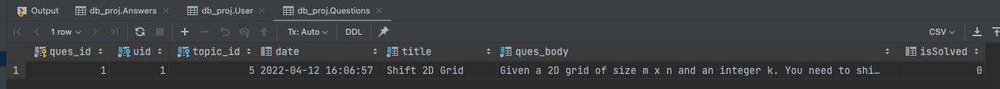

##### (3)

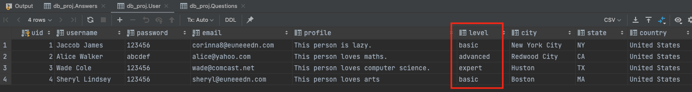

Clarification: As the result shows, Jaccob James is still basic user because he answered zero question, while Alice Walker and Wade Cole have been updated to adanced and expert respectively because they have answered 5 and 3 questions.


<figure>
  <figcaption align="center"><b>User-Answers Relation</b></figcaption>
</figure>

##### (4)


<figure>
  <figcaption align="center"><b>Result 4</b></figcaption>
</figure>

Clarification: Suppose given question id 3, we could get three answers. We can check the results by the orignal table Answers.


<figure>
  <figcaption align="center"><b>Answers Rows</b></figcaption>
</figure>

##### (5)


<figure>
  <figcaption align="center"><b>Result 5</b></figcaption>
</figure>

Clarification: We can illustrate the results by hand. For example, topic `Computer Science`(topic_id 1) has topic `Algorithms`(5) and `Database`(4) under it. Also, `Database` has `NoSQL`(6) under it. Therefore, CS should sum up all the questions and answers under those sub-topics. Let's look at questions number. It equals to 4 + 1 + 1 = 6. So the solution is correct. Plus, this solution will not miss topic with zero question or answer as it uses left join.


<figure>
  <figcaption align="center"><b>Topics</b></figcaption>
</figure>


<figure>
  <figcaption align="center"><b>QuestionID-TopicID</b></figcaption>
</figure>


<figure>
  <figcaption align="center"><b>AnswerID-TopicID</b></figcaption>
</figure>

##### (6)


<figure>
  <figcaption align="center"><b>Result 6</b></figcaption>
</figure>

Clarification: Question 2 gets the highest score because it contains both of the keywords("indexes" and "MySQL") in both the title and the question body. Also, there is an answer of it containing keyword "indexes". Q8 ranks 2nd as it has both keywords in its title but only has one keyword in the question body and no answer containing any keyword. Q7 get the lowest score since only its question body contains one keyword. 


<figure>
  <figcaption align="center"><b>Question Title</b></figcaption>
</figure>


<figure>
  <figcaption align="center"><b>Question Body</b></figcaption>
</figure>


<figure>
  <figcaption align="center"><b>Answers Body</b></figcaption>
</figure>
## Implementation

The enviroment setup can be found at:

Backend: https://github.com/1092772959/CSGY_6083_Database/tree/main/CSGY-6083-Backend
Frontend: https://github.com/1092772959/CSGY-6083-Frontend
Database: https://github.com/1092772959/CSGY_6083_Database


### Extra 

Apart from the basic function and scenarios, We realized the features for getting extra credits.

- Editing for the profile.
- Selection/Unselection of a best answer by the author
- Searching by keywords within one first-level topic or one second-level topic or two-level combined
- Sort the question by relevance (giving weights: question title > question body > answer body)
- SQL injection prevention and Hashing password stored.


### Backend Design

As for the backend of the web application, we implement our web service in Spring Boot, which is a popular Web framework in Java. It helps us focus more on business features and less on infrastructure. 

Our architecture is based on MVC. In the backend, we focus on implementing Controller and Model. 

#### Controller

The Controller can help converts the payload of the request from web browser to the internal structure of the data. Then, it can sends the data to Model for further processing. After CRUD with Model, it will get processed data from the Model and advances that data to the frontend.

We integrated Swagger2 in our project to display the API document and thus better communicating with frontend. The API can be found at 

http://localhost:8080/swagger-ui/#/

We designed RESTful style API. We can identify the manipulations of different resources from the URL.

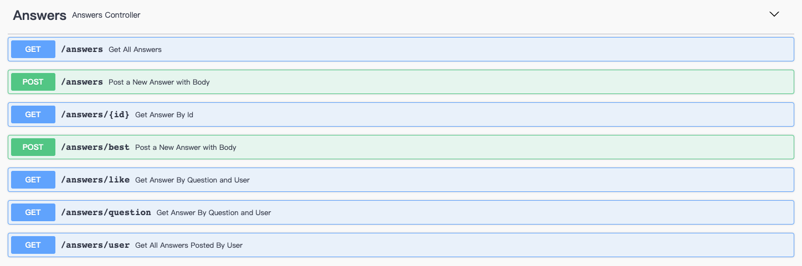

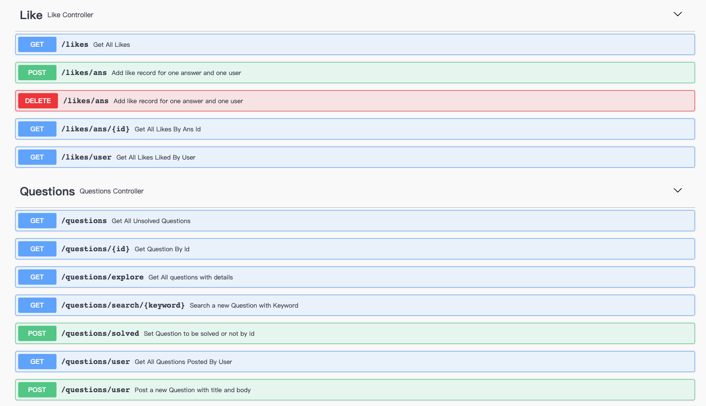

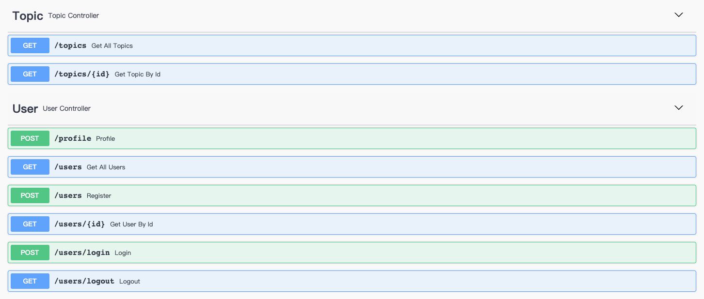


#### Model

The Model layer help us to map application calls to the persistence layer. 

We first defined several Java Classes (in domain) according to the tables in the relational database. Each column in table is related to a data field in Class.

Each record is related to the instance of the Class. 

Then, In order to call appropriate SQL and stored procedures that we have defined in the database in the first part. We integrated MyBatis, it supports custom SQL and advaned mappings. By defining different mappers (in dao), we can implement the DAO pattern that provides an abstract interface to help us query and manipulate data from a database using an object-oriented paradigm. We can also parse the SQL results to the Objects in application.


#### Security 

##### Password store

 Due to the insecurity of databases and the need to store the passwords. We utilized MD5 hash generator to encoding *passwords* before stored in the database. The same input has the same hash value. And passwords can stored in a secret manner.


##### SQL injecetion 

We use prepared statement and parameterized queries to prevent SQLi. Below is a code snippet.

```sql
@Select({"select * from User where username = #{username}"})
User getByUsername(@Param("username") String username);
```

The variables passed in through parameterized queries will never execute as live SQL code. If we pass the username as "Bob; drop table User", the drop will never be executed. However, we will search by the username with "Bob; drop table User".


#### Session

We realized two ways of maintaining session after user login to the application. One way is to use Cookie after the backend get the right user inforrmation. The server will generate a random token and set a token in cookie, browser can then include it in every subsequent request. In this way, we can find the questions, answers, and likes of the current user. When user log out, the token will be deleted. Another way is use localStorage in browser to store the uid of current user.


### Frontend design

In order to provide a good user experience for browsing as well as creating questions and answers, we decide to use React.js, which is a popular frontend framework, to build a web application. 

With this framework, we could design reusable and portable components which could be displayed in several pages. For example, we created Component Question and Answer that could be used in pages like My Questions, My Answers, Explore All Questions, etc. 

Also, we can use status of each component and the hook React provides to bind the data between different components. Hook is a feature that enables updating the status of a component even it is called in another component. For exmple, after setting a topic selector component, I can pass the hook to it to update the list of questions showed in the page. So, everytime the user select a certain topic, the question list will also be updated by this hook.

Besides, we use Material-UI(MUI) as the UI library for better visual effect. Basically, we can use the components of MUI to construct every thing in our web application in a timely manner. 


### Component

#### SignUp


On this page, our users should input a username, en email address and their password in the textInput fields. Click the sign up button, the backend server will create a user record in the table. The username should be unique in the User table; otherwise the applications will show error message if the user picks an existed name.


#### SignIn

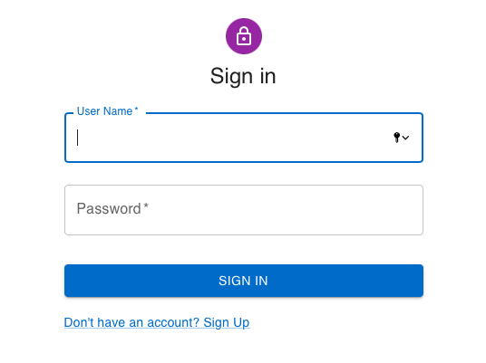

After signing up successfully, the web page will direct the user to the sign in page, on which the user is required to provide his username and password. If the username or the password is not matched according to the record in the database, the application will show alert as the screenshot below shows.


If the user provides correct username and password, the application will direct him to the home page.


#### Logout


Once the user want to logout from the application, he can click this button. Then the user information stored on the web application will be cleared, and he will directed to the login page.


#### SideBar

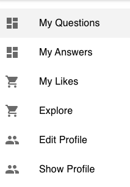

On the left side of the home page, users can see several items in the sidebar which could direct them to the specific pages. 


#### Question

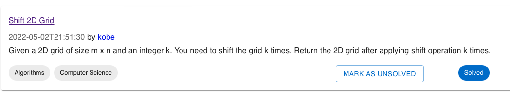

In home page, the user will first see all of the questions that written by the user himeself. 

For each question, there will be a box displaying the title, author, time when the question was posted, tags of two-hierachy topics, solved or not. If the current user is the author of this question, there will be a button that could mark it as solved or not; otherwise this button is hidden. Once the user clicks on the title of the question, he will be directed to the page showing all the answers of this questions.


#### Answer

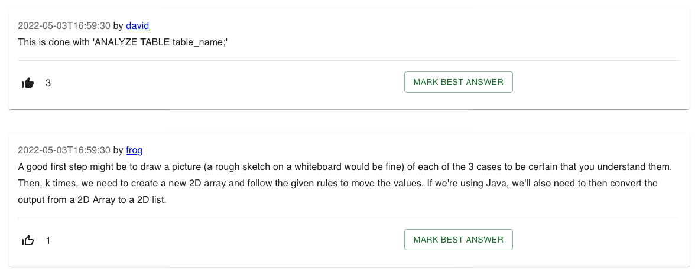

As the screeshot shows, the answer component contains the author of this answer, the date is was posted, the content, and the number of likes it gets from other users. Our user could click on the white thumbup icon to give a like to this answer; also he could click on the black thumbup icon to unlike an answer he liked before. The number on the right side will be changed accordingly.

If the current user is the author of this question, then he could pick an answer by clicking on the "Mark Best Answer" button, after that, the answer he picked would show a green icon denoting that it is the best answer. And the original Mark button would be changed to UNMARK. The user can click on it to remove the best answer tag whenever he wants. Once there is an answer was chosen as the best answer, the Mark button of those answers will disappear because we only want one answer to be the best.

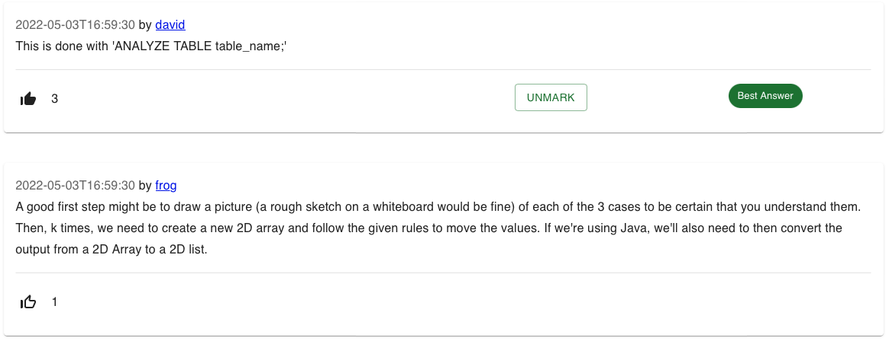


#### Topic Selector

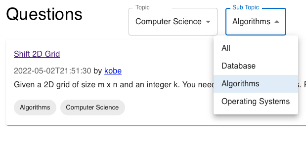

In this system, we have two tiers of topic hierachy. When browsing questions, users could select either only the first tier topic or two tiers of topics together to get the specific questions they want. Initially, both selectors are set to 'All' which denotes all of the questions. Once the user has selected the first tier topic, then the sub topics he could choose are determined. For example, in the screenshot, you can see once we choose `Computer Science` as the tier one topic, then the sub topics could only be those under Computer Science.


#### Posting

User can go to *My Questions* from the sidebars to post a new question.


Click on the *Ask Question*.

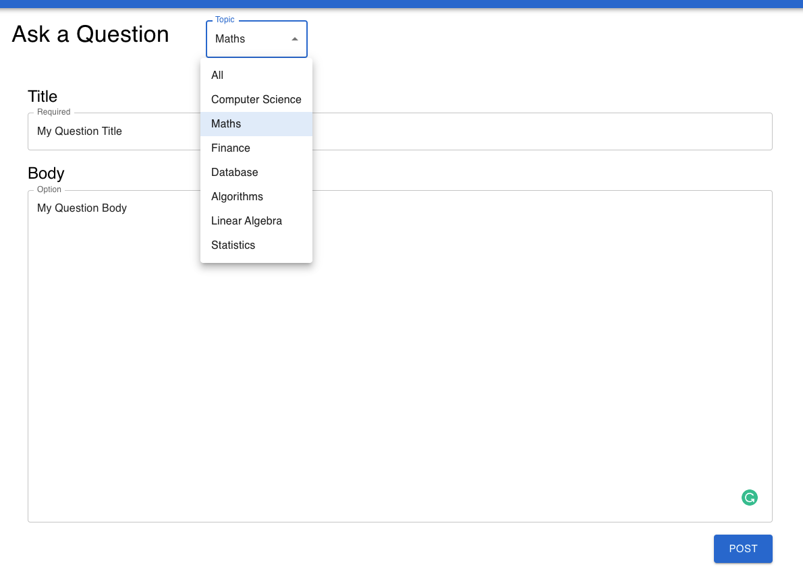

User may specify a topic for the question. The title cannot be empty.

Then it will direct to the My Questions page.

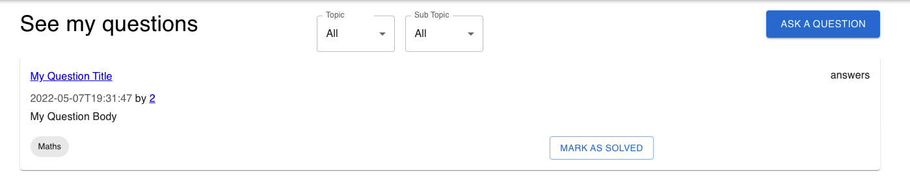


User can also go to Explore page and provide answers to questions posted by others.

 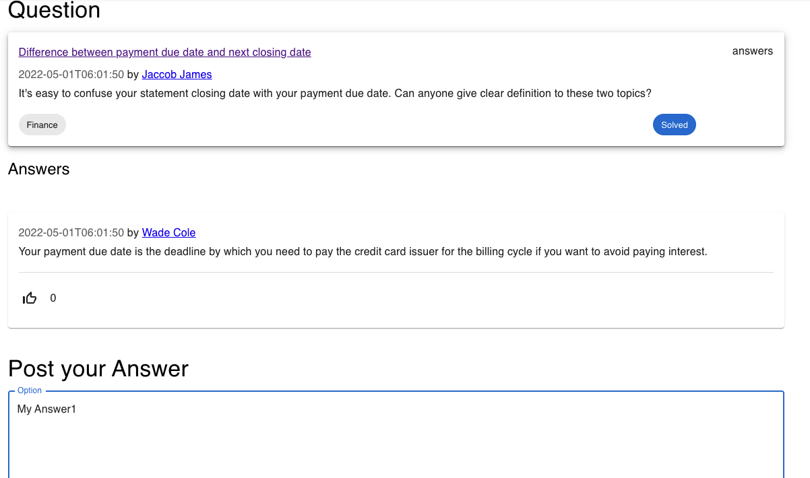


 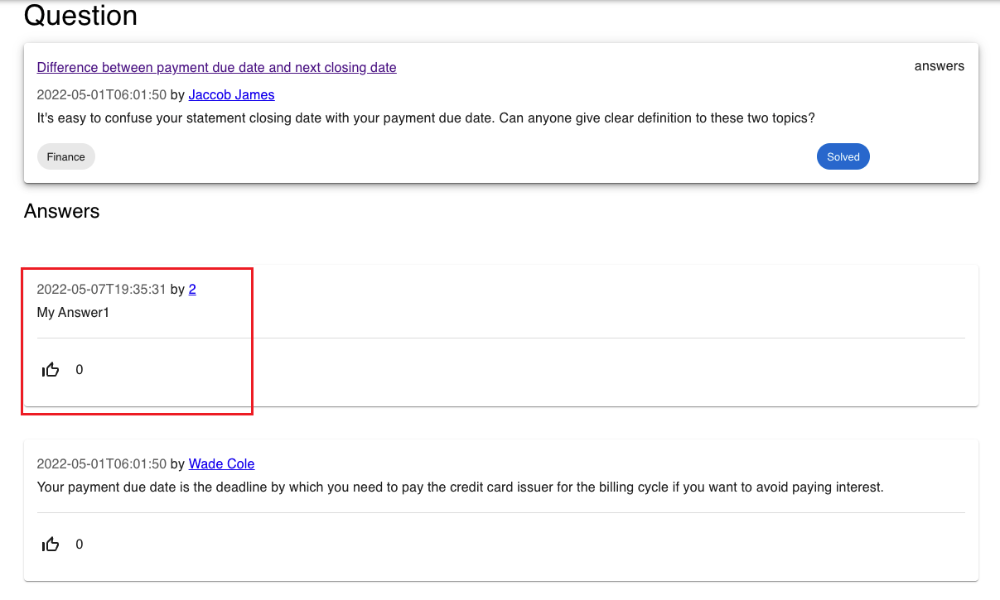


#### Searching

This applicatin support question search by keyword. It will display by relevance. 

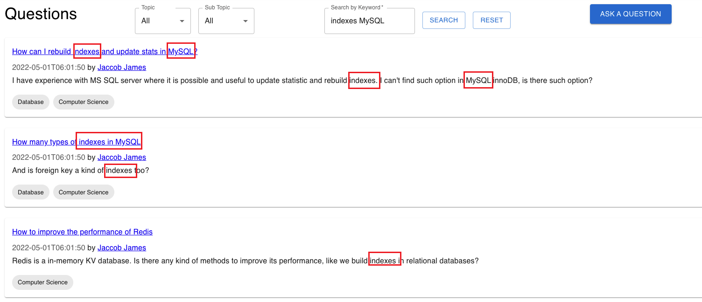


Also, if we select a topic at the same time, it will search the keyword within that topic.

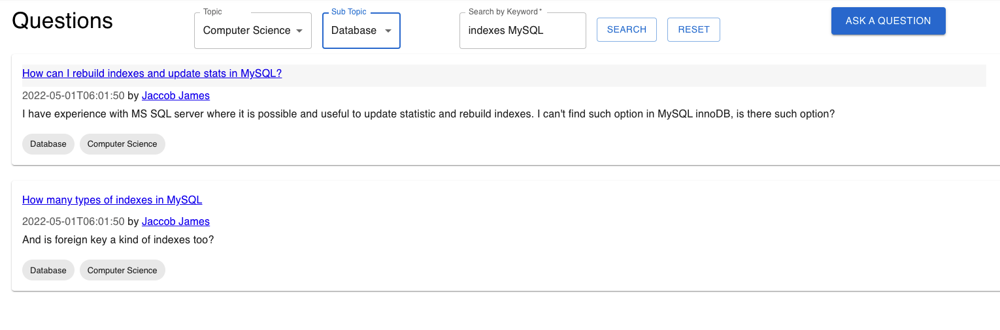


#### Profile

User can edit and display their profile once they are logged in. User cannot change to the same username with other users. 


After update successfully, page will display the update information.

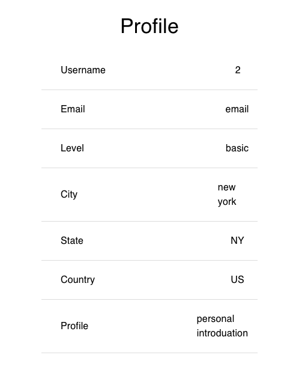
